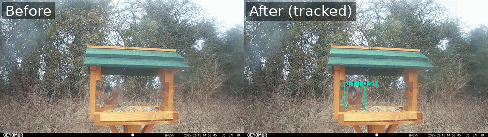

# Bird Object Detection Pipeline

A single-file Python pipeline for training and running a YOLO object detector on camera trap footage. Covers dataset download, model training, model validation, and video inference with object tracking.



*Left: original camera trap footage. Right: the same footage after running through `--track`, with detected objects boxed, tracked with a persistent ID, and labeled with their class and confidence score.*

## Contents

- [Initial Setup](#initial-setup)
- [Dataset](#dataset)
- [Model Training and Validation](#model-training-and-validation)
- [Video Inference and Object Tracking](#video-inference-and-object-tracking)
- [Usage](#usage)

---

## Initial Setup

Before running the pipeline, a number of core packages need to be installed. While a `requirements.txt` should be provided, it's worth using a package manager and manually installing the necessary packages with their dependencies. These include:

- [Ultralytics](https://pypi.org/project/ultralytics/)
- [Roboflow](https://pypi.org/project/roboflow/)
- [OpenCV](https://pypi.org/project/opencv-python/)
- [PyTorch](https://pypi.org/project/torch/) and [torchvision](https://pypi.org/project/torchvision/)
- [Pandas](https://pypi.org/project/pandas/)

The packages are designed to run on an **NVIDIA GPU with [CUDA](https://developer.nvidia.com/cuda-downloads)**. Depending on the GPU used, PyTorch must be installed to match the CUDA version of that GPU.

Check your GPU/CUDA version with:

```bash
nvidia-smi
```

Then install the CUDA-compatible `torch` and `torchvision` build from [PyTorch's website](https://pytorch.org/get-started/locally/).

Once installed, verify everything is wired together correctly:

```bash
python bird_complete.py --check
```

If Ultralytics, CUDA, and PyTorch are correctly installed, this will print diagnostic output showing all three, with a recognized GPU.

---

## Dataset

The dataset is downloaded from Roboflow. The only required information is:

- Your **API key**
- The **dataset version** (e.g. found at `https://app.roboflow.com/<workspace>/<project>/<version>`)
- The **dataset format** (YOLOv12 by default)

The downloaded dataset is automatically split into `train`, `test`, and `valid` subsets, with both images and annotations. It also includes a `data.yaml` file used to read in the dataset as a whole.

The download logic mirrors the code Roboflow generates when you select **"show download code"** on the dataset's [export page](https://app.roboflow.com/).

```bash
python bird_complete.py --download \
  --roboflow-api-key YOUR_KEY \
  --workspace trail-camera \
  --project sam-barrett \
  --dataset-version 10 \
  --dataset-format yolov12
```

If you've already downloaded a dataset, skip this step and point directly at its `data.yaml`:

```bash
--data-yaml /path/to/dataset/data.yaml
```

---

## Model Training and Validation

### Training

The desired YOLO model is loaded and trained on the Roboflow dataset. Hyperparameters (such as epochs) are configurable — see the full list of [training settings](https://docs.ultralytics.com/modes/train/#train-settings).

Training produces a `runs/detect/train<N>/` directory containing:

| File/Folder | Description |
|---|---|
| `weights/` | Learned weights — both best-performing (`best.pt`) and most recent (`last.pt`), used in later steps in place of the untrained model |
| `args.yaml` | Training hyperparameters, for reference |
| `Box_curve` | Metric/confidence curves showing how accurately boxes are drawn |
| `confusion_matrix` | Shows how the model performs at identifying each class |
| `labels` | Visualization of class spread and label placement |
| `results.csv` | Performance metrics logged at each epoch |
| `results.png` | Visualization of `results.csv` |
| `train_batch` | Sample training batch, showing augmentations |
| `val_batch_labels` | Sample validation images with original annotations |
| `val_batch_pred` | Sample validation images with predictions, for comparison |

More detail: [Ultralytics training docs](https://docs.ultralytics.com/modes/train/).

```bash
python bird_complete.py --train \
  --model yolo12n.pt \
  --epochs 100 \
  --device 0
```

Other model sizes/versions can be swapped in via `--model`, e.g. `yolo12s.pt`, `yolo12m.pt`, `yolo11m.pt`, `yolo10m.pt`.

### Selecting a trained model

After training, pick the `train<N>` run directory to use for validation and inference:

```bash
--run 3
```

This resolves to `runs/detect/train3/weights/best.pt`.

### Validation

Validation runs similarly to training, but only the dataset location is required. Output appears under `runs/detect/val<N>/`, containing `Box_curve`, `confusion_matrix`, `val_batch_labels`, and `val_batch_preds`.

```bash
python bird_complete.py --validate --run 3
```

---

## Video Inference and Object Tracking

The trained model weights are used to run detection and tracking over video footage. This stage expects all videos to be tracked in a `videos/` folder in the working directory, and saves per-video CSV results to a `results/` folder.

Additional tracking parameters are documented in the [Ultralytics inference arguments](https://docs.ultralytics.com/modes/predict/#inference-arguments).

```bash
python bird_complete.py --track --run 3
```

Each output CSV (`results/<video>_results.csv`) contains one row per detected box, per frame:

| Column | Description |
|---|---|
| `frame` | Frame number within the video |
| `id` | Tracked object ID (persists across frames) |
| `class` | Class name (mapped from the model's class index) |
| `confidence` | Detection confidence score |
| `x1, y1, x2, y2` | Bounding box coordinates |

Optional flags:

- `--save-annotated` — also save an annotated output video
- `--classes 0,2,3,4,5,6` — restrict tracking to specific class indices (e.g. omit a "feeder" class)
- `--video-dir` / `--results-dir` — override the default `videos/` and `results/` locations
- `--video-ext` — change the video file extension filter (default `.mp4`)

At the end of tracking, the script prints the class index-to-name mapping (`model.names`) for reference.

---

## Usage

Run the entire pipeline end-to-end:

```bash
python bird_complete.py --all --roboflow-api-key YOUR_KEY
```

Or run any subset of stages independently:

```bash
python bird_complete.py --check
python bird_complete.py --download --roboflow-api-key YOUR_KEY
python bird_complete.py --train --epochs 150 --model yolo12s.pt
python bird_complete.py --validate --run 3
python bird_complete.py --track --run 3
```

If no stage flag is passed at all, the script defaults to `--all`.


